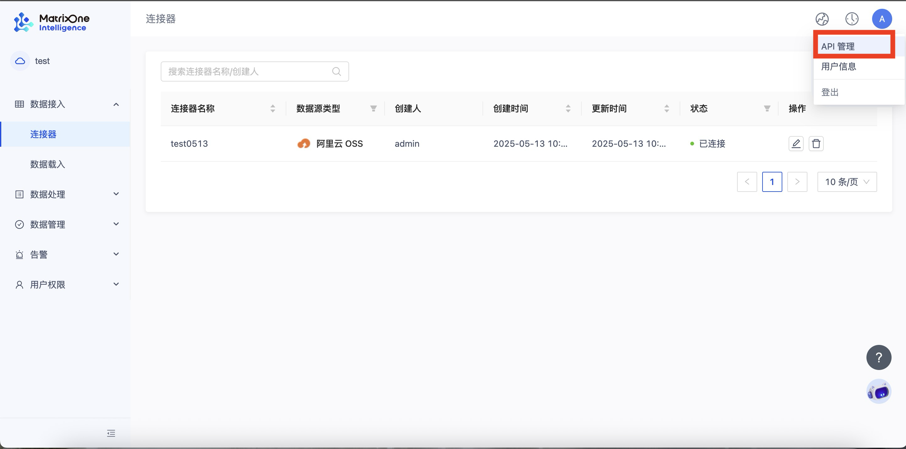

# 鉴权相关 API

## 获取 token

```
POST /auth/login
```

**输入参数：**
  
|  参数             | 是否必填 |含义|
|  --------------- | ------- |----  |
| account_name     | 是      | 工作区 ID |
| username         | 是      | 管理员名称 |
| password         | 是      | 管理员密码 |
| type             | 否      | 认证类型。如果值为 "workspace"，则视为工作区认证。如果未提供该参数或值不为 "workspace"，则默认为 MOC 认证。 |

**输出参数：**
  
|  参数             | 含义 |
|  --------------- | ----  |
| uid              | user uuid      |
| Access-Token     | 鉴权码，有效期 15 分钟     |
| Refresh-Token    | 用于 Access-Token 过期后刷新    |

**示例：**

```python
import requests
import json

url = "https://freetier-01.cn-hangzhou.cluster.matrixonecloud.cn/auth/login"
# 设置请求头
headers = {
    "Accept": "application/json, text/plain, */*",
    "Content-Type": "application/json"
}
body = {
    "account_name": "YOUR_ACCOUNT_NAME",
    "username": "YOUR_USERNAME",
    "password": "YOUR_PASSWORD",
    "type": "workspace" # 可选。值为 "workspace" 时为工作区认证，不传或其他值则默认为 MOC 认证。
}

# 发送请求
response = requests.post(url, headers=headers, json=body)

# 打印响应头和内容（格式化 JSON）
print("Response Headers:", json.dumps(dict(response.headers), indent=4))
print("Response Body:", json.dumps(response.json(), indent=4, ensure_ascii=False))
```

返回：

```bash
Response Headers: {
    "Date": "Wed, 12 Feb 2025 03:38:36 GMT",
    "Content-Type": "application/json; charset=utf-8",
    "Content-Length": "178",
    "Connection": "keep-alive",
    "Access-Token": "YOUR_ACCESS_TOKEN",
    "Refresh-Token": "YOUR_REFRESH_TOKEN",
    "X-Request-Id": "YOUR_REQUEST_ID",
    "Set-Cookie": "SERVERID=YOUR_COOKIE_SERVERID_VALUE|TIMESTAMP|TIMESTAMP;Path=/"
}
Response Body: {
    "code": "OK",
    "msg": "OK",
    "data": {
        "uid": "YOUR_UID",
        "login_at": "2025-02-12T03:38:36.566638078Z"
    }
}
```

在 Response Header 中获取 access-token 和 refresh-token，从返回结构体中获取 uid。Access-Token 有效期 15min，过期之前，需要调用下面 Refresh 接口，获取新的 Access-Token。后续请求中，**Access-Token** 和 **uid** 可用于生成/刷新 moi-key，方便调用其他 API。

## 刷新 token

在 Access-Token 过期之前，请求中带上 Access-Token，Refresh-Token 和 Uid，新的 Access-Token，Refresh-Token 会在 Response Header 中返回

```
POST auth/refresh
```

**示例：**

其中，accsee-token、refresh-token 和 uid 在**获取 token** 步骤返回。

```python
import requests
import json
# API URL
url = "https://freetier-01.cn-hangzhou.cluster.matrixonecloud.cn/auth/refresh"

# 请求头
headers = {
    "Accept": "application/json, text/plain, */*",
    "Content-Type": "application/json",
    "Access-Token": "YOUR_ACCESS_TOKEN",
    "Refresh-Token": "YOUR_REFRESH_TOKEN",
    "uid": "YOUR_UID"
}

# 请求体（Body JSON）
body = {
    "type": "user"
}

# 发送请求
response = requests.post(url, headers=headers, json=body)

# 打印响应头和内容（格式化 JSON）
print("Response Headers:", json.dumps(dict(response.headers), indent=4))
print("Response Body:", json.dumps(response.json(), indent=4, ensure_ascii=False))
```

返回：

```bash
Response Headers: {
    "Date": "Wed, 12 Feb 2025 03:40:45 GMT",
    "Content-Type": "application/json; charset=utf-8",
    "Content-Length": "24",
    "Connection": "keep-alive",
    "Access-Token": "YOUR_NEW_ACCESS_TOKEN",
    "X-Request-Id": "YOUR_REQUEST_ID",
    "Set-Cookie": "SERVERID=YOUR_COOKIE_SERVERID_VALUE|TIMESTAMP|TIMESTAMP;Path=/"
}
Response Body: {
    "code": "OK",
    "msg": "OK"
}
```

## API Key 管理

**说明：**下述接口用于管理 MOI 工作区的 API Key。成功获取或创建 API Key 后，其返回的 `moi-key` 在请求其他 MOI 业务 API 时，在 Header 中传递以进行鉴权。

**获取 API KEY 的操作步骤：**登录 GenAI 工作区平台后，点击页面右上角的用户头像，在下拉菜单中选择 "API 管理" 选项，即可查看、获取或更新您的 API 密钥。



*图示：在页面右上角点击用户头像，可以看到下拉菜单中的 "API 管理" 选项*

### 创建 API Key

```
POST /user/me/api-key
```

**描述：**为当前用户创建一个新的 API Key (moi-key)。

**Header 参数：**

| 参数名         | 类型   | 是否必填 | 描述                        |
| -------------- | ------ | -------- | --------------------------- |
| `access-token` | string | 是       | 账户认证 token  |
| `uid`          | string | 是       | 账户 ID      |

**响应参数：**

| 参数名       | 类型   | 含义                         |
| ------------ | ------ | ---------------------------- |
| `key`        | string | 生成的 API Key (moi-key)       |
| `created_at` | string | 创建时间|
| `request_id` | string | 请求 ID                 |

**示例 (Python):**

```python
import requests
import json

# 假设 access_token 和 uid 已通过登录接口获取
access_token = "YOUR_ACCESS_TOKEN"
uid = "YOUR_USER_ID"
api_endpoint = "https://freetier-01.cn-hangzhou.cluster.matrixonecloud.cn"

url = f"{api_endpoint}/user/me/api-key"

headers = {
    "access-token": access_token,
    "uid": uid,
    "Content-Type": "application/json",
    "Accept": "application/json"
}

response = requests.post(url, headers=headers, json={})

print("Status Code:", response.status_code)
if response.status_code == 200:
    try:
        response_data = response.json()
        print("Response Body (new moi-key details):", json.dumps(response_data, indent=4, ensure_ascii=False))
        new_moi_key = response_data.get("data", {}).get("key")
        if new_moi_key:
            print(f"Successfully created new moi-key: {new_moi_key}")
        else:
            print("New moi-key not found in response.")
    except json.JSONDecodeError:
        print("Error decoding JSON from response:", response.text)
else:
    print("Error Response Body:", response.text)
```

**示例 (JSON Response):**

```json
{
  "code": "OK",
  "msg": "OK",
  "data": {
    "key": "YOUR_NEW_MOI_KEY_STRING",
    "created_at": "2023-05-29T08:06:42Z"
  },
  "request_id": "YOUR_REQUEST_ID"
}
```

### 刷新 API Key

```
POST /user/me/api-key/refresh
```

**描述：**为当前用户生成一个新的 API Key (moi-key)，旧的 API Key 将失效。

**Header 参数：**

| 参数名         | 类型   | 是否必填 | 描述                        |
| -------------- | ------ | -------- | --------------------------- |
| `access-token` | string | 是       | 账户认证 token|
| `uid`          | string | 是       | 账户 ID |

**响应参数 (`200 OK`):**

| 参数名       | 类型   | 含义                               |
| ------------ | ------ | ---------------------------------- |
| `key`        | string | 新生成的 API Key (moi-key)           |
| `created_at` | string | 新 Key 创建时间|
| `request_id` | string | 请求 ID                       |

**示例 (Python):**

```python
import requests
import json

# 假设 access_token 和 uid 已通过登录接口获取
access_token = "YOUR_ACCESS_TOKEN"
uid = "YOUR_USER_ID"
api_endpoint = "https://freetier-01.cn-hangzhou.cluster.matrixonecloud.cn"

url = f"{api_endpoint}/user/me/api-key/refresh"

headers = {
    "access-token": access_token,
    "uid": uid,
    "Content-Type": "application/json",
    "Accept": "application/json"
}

response = requests.post(url, headers=headers, json={})

print("Status Code:", response.status_code)
if response.status_code == 200:
    try:
        response_data = response.json()
        print("Response Body (refreshed moi-key details):", json.dumps(response_data, indent=4, ensure_ascii=False))
        refreshed_moi_key = response_data.get("data", {}).get("key")
        if refreshed_moi_key:
            print(f"Successfully refreshed moi-key: {refreshed_moi_key}")
        else:
            print("Refreshed moi-key not found in response.")
    except json.JSONDecodeError:
        print("Error decoding JSON from response:", response.text)
else:
    print("Error Response Body:", response.text)
```

**示例 (JSON Response):**

```json
{
  "code": "OK",
  "msg": "OK",
  "data": {
    "key": "YOUR_REFRESHED_MOI_KEY_STRING",
    "created_at": "2023-05-29T08:10:00Z"
  },
  "request_id": "YOUR_REQUEST_ID"
}
```
