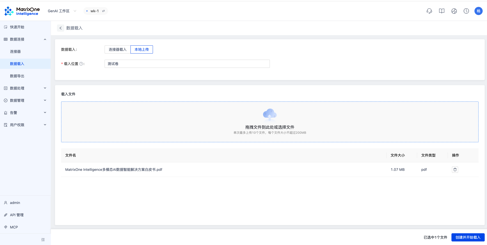
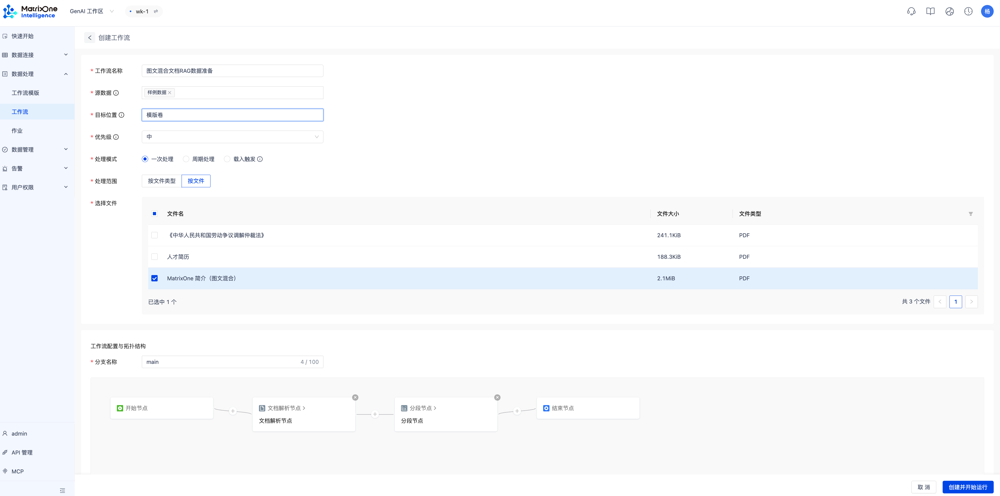
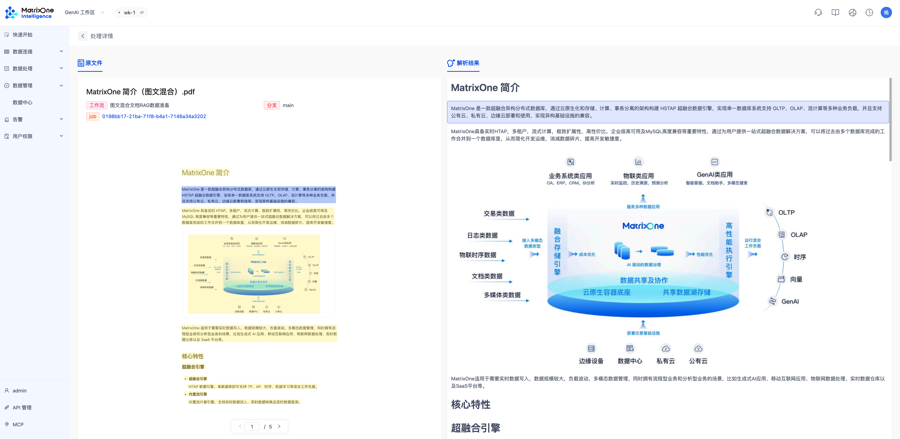

# 快速上手 GenAI 工作区

在本篇文档中，我们将指导您快速创建和使用 GenAI 工作区。

## 第一步：创建 MatrixOne Intelligence 账户

### 1. 注册 MatrixOne Intelligence

- 访问 [MatrixOne Intelligence 注册页面](https://www.matrixorigin.cn/moi-signup)。
- 填写您的注册信息，并点击**注册**。

**注意：**注册时填写的邮箱将自动注册成为您的 MatrixOne Intelligence 账户。

### 2. 激活 MatrixOne Intelligence 账户

当您点击注册后，我们会发送一封激活邮件到您提供的邮箱地址。请按照邮件中的链接完成激活。

### 3. 登录 MatrixOne Intelligence 账户

激活成功后，会跳转到登录界面，输入账户密码即可登录至 MatrixOne Intelligence 管理平台。

## 第二步：创建 GenAI 工作区

### 1. 打开工作区创建页面

在 **GenAI 工作区**页面，点击**创建工作区**按钮。

### 2. 配置工作区信息

- **名称：**为您的工作区去一个名称。
- **管理员名称：**为您的工作区取一个管理员名称，或者使用平台自动生成的名称。
- **管理员密码：**设置管理员密码。

### 3. 完成创建

点击**创建**完成创建。几秒后，状态为**可用**时，表示工作区创建成功。

## 第三步：进入工作区

### 1. 打开工作区管理平台

点击工作区列表右方的跳转图标以打开工作区管理平台的登录页面。

### 2. 输入管理员用户名和密码

在登录页面中输入以下信息：

- **用户名：**创建工作区时设置的管理员名称，默认为 admin。
- **密码：**创建工作区时设置的管理员密码。

## 数据处理

### 1. 数据载入

- 在菜单栏的数据接入中点击并进入**数据载入**页面。
- 在编数据载入页面右上角点击**载入数据**。
- 在数据载入页面选择**本地上传**，并输入以下配置信息：
    - 载入位置：下拉处添加原始数据卷
    - 上传 PDF 文件
    - 选择需要载入的文件
- 查看数据载入列表，等待状态变成**完成**

### 2. 创建工作流

- 在菜单栏的数据处理处中点击并进入**工作流**页面
- 在工作流页面右上角点击**创建工作流**
- 在创建工作流界面输入以下信息
    - 工作流名称
    - 源数据卷：选择上一步创建的原始数据卷
    - 目标数据卷：在下拉处添加目标数据卷
    - 处理模式：保持默认值
    - 优先级：保持默认值
    - 文件类型：选择文本类型
    - 分支名称：保持默认值
    - 处理流程图：只需保留文本解析节点
- 查看工作流列表，等待状态变成**完成**

### 3. 查看文件解析结果

- 在菜单栏的数据探索处中点击并进入 **Catalog** 页面
- 在处理数据卷中找到上一步创建的目标数据卷
- 点击文件名称查看文件解析情况
  

    

### 4. 下载解析数据

点击右侧下载按钮，即可获得一个包含文字解析信息和图片资源的文件夹，文件夹内包括：

- JSON 文件：记录完整的文字解析内容，包括文件基础信息、分段类型、分段所在页码以及对应图片的原始元数据。
- 图片文件夹：存放文档中解析生成的图片资源，便于后续查看与使用。
- full.md 文件：完整 Markdown 内容文件。

恭喜您成功创建 GenAI 工作区并完成文件处理全流程！有关 GenAI 工作区的更多操作详情，可参阅 [GenAI 工作区](../Workspace-Mgmt/overview.md)相关章节。

如需更多支持，请查阅我们的文档或联系支持团队。
