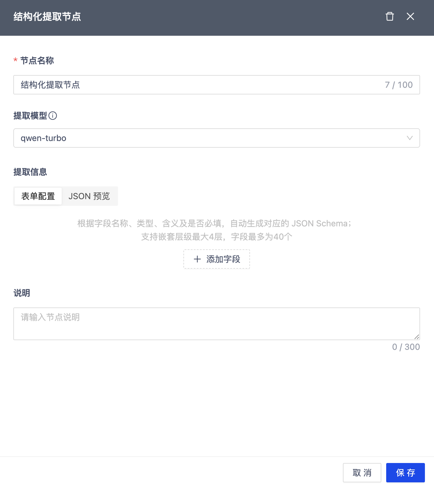
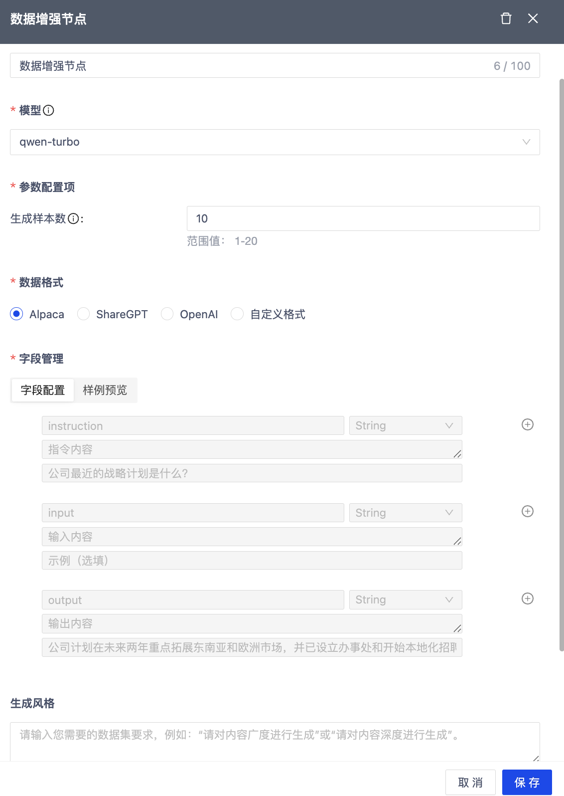

# **MatrixOne Intelligence 2025 发布报告**

## 2025 年 07 月 05 日

**功能**

- 工作流支持结构化提取节点
  
新增结构化提取节点，结合 JSON Schema 标准与 AI 模型能力，能够对解析节点生成的文本内容进行智能识别与字段提取，自动生成符合规范的结构化数据。该功能有效提升了非结构化文档的处理效率，实现从原始文本到结构化数据的高效转换，便于后续存储、分析与知识构建。

此外，为帮助用户快速上手并集成使用，我们同步推出了结构化提取相关的快速开始 API，将核心能力模块化封装，支持便捷调用与灵活对接，加速结构化数据提取功能的落地应用。

  

- 数据增强节点支持更多数据格式
  
数据增强节点现已新增支持 ShareGPT Format、OpenAI Format 及自定义格式三种输出方式。通过可视化配置界面，用户可灵活组合字段、调整输出参数，按需生成符合不同应用场景的数据格式，显著提升数据处理的灵活性与适配能力。

  

- GenAI 工作区支持 MCP 协议
  
GenAI 工作区现已全面支持 MCP 协议，使模型能够以标准化方式调用平台 API，实现多工具协同与任务链路自动规划。通过 MCP 协议，模型可根据用户输入智能拆解意图，自主完成任务路径规划与多步骤工具调用，进一步降低用户操作门槛，提升平台的智能化和自动化能力。

- 支持解析结果与原文对比功能
  
现已上线解析结果高亮展示功能，支持在原始 PDF 文件中基于页面布局（layout）定位并高亮对应的解析字段。用户可通过页面结构与解析结果的对应关系，直观对比提取效果，快速评估解析准确性与模型表现。目前仅支持 PDF 文件，后续将逐步扩展更多格式。

  

- 官网体验中心上线
  
官网体验中心上线第一个体验 Demo，旨在帮助用户快速了解 MOI 在文档解析领域的综合能力，集成了结构化抽取、文档解析和文档对话三大核心功能。通过 Demo，用户可直观体验系统如何精准提取关键字段，将非结构化文本转化为结构化数据；如何深度解析文档内容，支持多格式和复杂版面；以及如何通过智能对话，实现基于解析结果的自然语言问答，快速获取所需信息，全面展现 MOI 在文档理解和智能交互方面的技术实力与应用价值。

用户可免登录体验 Demo 中的样例数据，若需使用自有数据则需登录。为提升用户体验，官网新增了手机号快速注册与登录功能，方便用户便捷访问和快速上手。

  

- 处理数据支持导出到 Dify
  
新增数据导出连接器功能，当前支持将处理后的数据直接导出至 Dify 知识库，便于用户快速构建和更新知识库内容，提升数据利用效率。

- 工作流支持文本嵌入节点
  
将原有文本解析节点和图片解析节点中的文本嵌入功能拆分独立，形成单独的文本嵌入节点。此举提升了解析流程的模块化和灵活性，方便用户根据实际需求灵活组合和调用相关能力。

- 文件与图片解析节点支持 OCR、图片描述及语言切换开关
  
支持在文件解析节点和图片解析节点中新增 OCR 和图片描述的开关配置。用户可根据实际需求灵活启用或关闭相关功能，提升解析流程的可控性与适配性。其中，图片描述功能现已支持语言选择，可在中英文之间切换，满足不同场景下的语言输出需求。

- 新增结构化抽取快速开始 API
  
为了帮助用户快速上手并体验我们的产品，我们构建了一套快速开始 API，用于将核心单点能力模块化抽取。本期新增了结构化抽取相关的快速开始 API，方便用户快速集成并高效调用结构化数据提取功能。

- 支持更多文本分段方式
  
文本分段节点新增支持按单个标志符、多个标志符以及自定义标志符进行分段，进一步提升文本处理的灵活性和适配能力。用户可根据实际业务需求灵活设置分段规则，实现更加精准、高效的文本切分操作。

- 支持解析文档标题
  
解析结果现已支持对文本标题进行细粒度识别，新增一级标题，某些场景下支持二级标题、三级标题子类型分类，进一步提升文档结构理解能力。该能力有助于更准确地还原原文层级结构，支持后续更精细的内容抽取与知识构建。

**改进**

- 优化了工作流界面，提升整体操作体验；
- 优化了创建工作流时的校验逻辑，增强流程规范性与稳定性；
- 优化了本地文件上传界面，使上传过程更加直观便捷；
- 优化了分段里有关 type 和 level 的显示；
- 优化了用户视角下的 api 使用流程，新增了告警相关的 api；

**错误修复**

- 修复了图片描述重复输出的问题；
- 修复了数据增强节点样本数不生效的问题；
- 修复了某些场景下图片只有图片描述而没有 OCR 结果的情况；
- 修复了 bmp 文件解析后只有 OCR 而没有图片描述的情况；
- 修复了告警记录某些情况下展示不全的问题；
- 修复了修改工作流节点名称无效的问题；
- 修复了部分文件经过数据增强后没有生成 QA 对的问题；
- 修复了部分情况下工作流执行状态异常的问题；
- 修复了英文版平台部分提示语还是中文的情况；
- 修复了部分情况下文件解析任务失败报错 Read timed out 的问题；
- 修复了工作区告警阈值显示有误的问题；
- 修复了工作区告警规则“仅告警一次”未生效的问题；
- 修复了工作区告警开启限时禁用无效的问题；
- 修复了数据卷中查看文件详情，block 类型过滤无效的问题；
- 修复了某些情况下处理 PPT 类型文件失败的问题；
- 修复了某些情况下经过工作流处理后 pdf 类型文件丢数据的问题；
- 修复了关联工作流 - 连续数据载入，偶现新载入文件未触发作业执行的问题；
- 修复了工作区中修改用户密码是报错的问题；
- 修复了处理数据卷中删除文本块失败的问题；

## 2025 年 06 月 20 日

**功能**

- 支持本地文件载入
  
本次更新新增本地上传功能，用户可直接导入本地文件，轻松完成数据载入与测试，大幅度降低体验门槛。

## 2025 年 06 月 06 日

**错误修复**

- 修复了原始数据卷图片展示有误的问题；
- 修复了过滤工作流状态，报错 500 的问题；
- 修复了文件处理详情中，解析好的音频展示类型为文本的问题；
- 修复了编辑拓扑图触发工作流，编辑的拓扑图不生效的问题；
- 修复了数据清洗节点中修改任何开关或参数均不生效的问题；
- 修复了作业详情展示的工作流和创建的工作流不一致的问题；
- 修复了工作流中只有起始和结束节点的工作流不应该实际运行的问题；
- 修复了创建工作流中带图片类型，工作流详情未显示文件类型的问题；
- 修复了工作流里取消勾选文档类型，整个工作流图消失的问题；
- 修复了工作流 - 文件基础信息里的文件类型筛选框，一级类型显示的都是英文的问题；
- 修复了修改工作流分支的节点参数显示成功实际未生效的问题；
- 修复了关联处理工作流 - 新建的工作流未触发作业执行的问题；
- 修复了作业中已停止的文件不应该出现在 catalog 中的问题；
- 修复了超级管理员在英文情况展示有误的问题；
- 修复了处理数据卷文件列表接口报 500 错误的问题；
- 修复了 doc 文件中的表格转换成 md 后，排版和格式转换有问题；
- 修复了修改工作流基础信息，选择目标数据卷时未过滤掉被使用的数据卷的问题；
- 修复了工作流节点详情页显示的节点名称都是英文格式的问题；
- 修复了工作流分支对比中处理节点详情显示有误的问题；
- 修复了增强节点中数据集格式解释文案有误的问题；
- 修复了新建或编辑分支时，节点名称没有默认值的问题；
- 修复了数据清洗节点部分参数没有默认值的问题；
- 修复了工作流节点不能删减的问题；
- 修复了处理数据卷中预览按钮不生效的问题；
- 修复了周期处理工作流创建失败的问题；
- 修复了关联处理工作流处理失败的问题；
- 修复了数据库管理平台无法登录的问题；
- 修复了数据增强节点产生的 QA 对中含有跟原文对不上的内容的问题；
- 修复了部分文件增强后没有生成 qa 对的情况；
- 修复了载入文件，部分文件类型未展示的问题；
- 修复了编辑工作流，修改文件类型未生效的问题；
- 修复了数据增强后的 qa 对分页中间有某些页无数据的问题；
- 修复了数据清洗节点设置清洗功能后文件处理失败的问题；
- 修复了创建工作流分支，切换主分支不生效的问题；
- 修复了 MP4 文件处理结果为空的问题；
- 修复了音视频解析内容乱码的问题；

## 2025 年 05 月 29 日

**功能**

【功能一】工作流数据处理能力全面升级

工作流模块全面强化了多源异构数据的处理、清洗与增强能力，显著提升大模型应用中数据预处理的效率与质量，为构建高效的 RAG 系统与指令微调方案提供有力支撑。

- 多模态内容解析：支持文本、图像、音频、视频等类型文件的解析算子，自动提取结构化信息，贯通非结构化数据向知识库构建的关键路径。
- 数据清洗算子：内置多种清洗策略，涵盖格式规范、去重、脱敏等操作，确保数据准确、规范、可用。
- 数据增强算子：支持自动生成符合 Alpaca 格式的数据集，适用于指令微调、对话训练、意图识别等多种应用场景。

【功能二】GenAI 工作区 API 密钥管理

为支持第三方应用、自动化脚本及内部服务安全、统一地调用平台 API，GenAI 工作区现已上线 API 密钥管理功能，帮助用户更安全、便捷地接入平台服务。该功能支持首次生成密钥并进行脱敏展示，提供一键复制，便于安全集成；同时具备密钥刷新机制，助力统一权限管理与风险防控，确保 API 调用过程中的安全性、可控性与高效性。

【功能三】支持更多告警规则

本次更新扩展了告警规则的配置能力：

- 数据加载：新增对单次载入任务的载入成功率阈值配置。
- 数据处理：新增对单文件分段数阈值及单作业中文件处理成功率阈值的支持。

【功能四】支持更多文件类型导出完整的未分段内容

新增支持 DOC/DOCX、PPT/PPTX、TXT 格式文件，导出完整未分段的 Markdown（full.md）文件，便于整体查看与归档。

**错误修复**

- 修复了工作流优先级不支持筛选的问题；
- 修复了部分情况下告警未正常触发的问题；
- 修复了工作流分支名称过长未分行展示的问题；

## 2025 年 05 月 22 日

**功能**

【功能一】GenAI 工作区引入基于角色的访问控制（RBAC）机制

为实现更加安全、灵活和可扩展的权限管理，GenAI 工作区全面引入 RBAC（基于角色的访问控制）模型。该模型通过“用户 - 角色 - 权限”三层结构实现权限的统一分配与集中管理：用户不直接拥有权限，而是通过绑定角色间接获得权限。支持权限的集中配置与复用，实现权限管理的抽象化、标准化与规模化。  

在工作区创建完成后，系统默认生成两个角色：

- 超级管理员：拥有对工作区所有资源和操作的完全权限，不可修改、禁用或删除，用于保障系统的核心管理能力。
- 数据开发：同样具备全权限，但可根据实际需求进行修改、禁用或删除，支持灵活配置与角色继承。
  
通过 RBAC 模型，GenAI 支持企业用户在多用户协作环境下实现更安全、高效、可控的访问权限管理策略，为组织级应用提供坚实保障。

【功能二】支持工作流与周期数据载入任务关联

为提升自动化处理能力，平台现支持将工作流与周期数据载入任务进行关联。启用关联后，工作流将依据源数据卷中相关载入任务的完成情况自动触发执行，从而增强数据更新与处理流程的联动性，实现更高效的数据驱动自动化。

【功能三】丰富告警规则

本次更新进一步丰富了告警规则体系，支持更多类型的表达式与灵活配置，包括：

- 数据加载阶段
    - 可设置单次任务载入文件数的阈值告警
    - 支持对单次载入任务的文件平均载入时间设置阈值告警

- 数据处理阶段：
    - 支持对单个作业处理文件数设置阈值告警
    - 可配置单文件处理时长的告警阈值
  
通过更精细的告警策略配置，系统可提前感知潜在异常，提升数据任务稳定性与监控可控性。

**错误修复**

- 修复了数据周期载入任务在某些情况下未正常触发文件载入的问题；
- 修复了一个表格同一个 chunk 中，如果引用了多个图片，这些图片的顺序错乱的问题；
- 修复了部分符号解析错误的问题；
- 修复了工作流删除后，作业列表中点击工作流名称前端显示报错信息有误的问题；
- 修复了工作流创建后无法编辑优先级的问题。

## 2025 年 05 月 08 日

**功能**

【功能一】工作区支持告警功能

为进一步保障工作区服务的稳定性、安全性和性能可控性，我们正式上线了告警管理功能，帮助用户实现更高效、精细化的运维监控。

- 灵活配置告警规则：支持创建覆盖数据加载与数据处理过程的个性化告警规则。用户可根据实际业务需求设定特定阈值，精准捕捉潜在异常，实现自动化风险预警与管理。
- 多渠道告警通知机制：提供集中式的告警联系人管理，用户可灵活添加、编辑或禁用、删除通知对象。支持邮箱、电话、短信和企业微信多种通知渠道，确保关键告警信息能够快速、准确传达到相关责任人手中。
- 告警日志留存与查询：系统自动保存所有告警事件记录，形成完整的告警日志体系。用户可通过界面查询近一个月内的历史告警，支持回溯分析与问题定位，助力技术团队高效应对和复盘处理突发事件。

【功能二】工作流新增“处理优先级”功能
  
为提升多任务场景下的调度效率，平台现支持为工作流设置“处理优先级”。用户可在创建或编辑工作流时指定优先级，选项包括“低”、“中”和“高”，默认值为“中”。设置后，新的工作流作业将根据该优先级即时生效。当多个工作流并发执行时，平台将按照优先级从高到低的顺序依次调度执行，确保关键任务优先处理。

【功能三】工作区解析结果导出增强
  
- 在导出 PDF 文件的处理结果时，除原有的分段 JSON 格式外，新增支持导出为完整 Markdown 内容文件；
- JSON 文件中图片类型的 block 新增字段 level，用于标识图像处理级别：1 表示 OCR 识别结果，2 表示 caption 结果。

【功能四】私有化部署新增支持配置文件大小上限
  
为满足不同业务场景下的大文件处理需求，我们对私有化部署中的文件处理功能进行了增强。平台现已支持通过配置项灵活设置单个文件的载入与处理大小上限，最高可配置至 10,000MB。

**错误修复**

- 修复了处理数据卷里的分支数据被删除了（分支子目录保留），新建工作流还是能使用该处理数据卷的问题；
- 修复了作业详情页的执行详情分页错误的问题；
- 修复了文件解析结果中缺少 OCR 内容的问题。

## 2025 年 04 月 24 日

**改进**

- 工作流分段组件支持自定义设置分段重叠。
  
- 优化了解析数据的下载格式，新格式从一个 json 文件变为一个文件夹，文件夹中包含了文字解析信息的 json 文件，以及图片文件夹。其中 json 文件中增加了文件信息、分段类型、分段所在页，此外增加了图片的原始信息。

**错误修复**

- 解决了某些情况下文件处理后丢失图片的问题

## 2025 年 04 月 10 日

**功能**

- 支持工作流分支管理

在本次版本更新中，支持对工作流分支进行管理，旨在帮助数据工程师高效管理相似的数据处理流程，提升开发效率，降低运维成本。
该功能支持用户基于同一个工作流创建多个分支版本，多个分支共享通用配置信息（如源数据卷、文件类型等），但可独立配置各自的数据处理流程。各分支的执行结果将按分支名称分别存储在目标数据卷的子目录中，确保版本间数据清晰隔离，便于管理与追踪，可有效应对以下使用场景：

1. 降低管理成本：避免重复创建高度相似的工作流，统一维护更高效
2. 优化资源使用：共享处理步骤仅需执行一次，结果复用，降低计算与存储开销
3. 简化对比分析：便于直观对比不同分支间的流程配置与执行结果，辅助评估与调优

 

    

- GenAI 工作区支持用户权限管理
  
在本次迭代中，GenAI 工作区正式引入 RBAC（基于角色的访问控制）模型，作为多模态数据集成、处理与应用的平台核心权限管理机制。该模型通过“用户 - 角色 - 权限”的映射关系，实现对平台访问范围与操作权限的精细化控制，确保系统使用的灵活性与安全性。
当前版本内置默认角色“数据开发”，拥有除用户管理外的全部操作权限。未来版本将逐步扩展更多角色，以满足不同类型用户在数据处理、模型应用等多场景下的权限需求。

- 工作流支持处理更多文档类型
  
在本次版本更新中，工作流支持处理更多文档类型，进一步提升了对多模态数据的适配能力与处理灵活性。用户在创建工作流时，可选择包括 txt/md、doc/docx、ppt/pptx 等更多文件格式，系统将根据所选类型，智能推荐匹配的处理组件集合，简化配置流程，提升使用效率。

- 支持原始数据卷文件预览
  
支持对原始数据卷中的原始文件进行在线预览，方便用户在数据处理前快速查看文件内容，提升数据管理与操作的便捷性。

- 支持轻量级添加 Python 脚本的依赖包
  
私有化部署版本支持轻量级添加 Python 脚本依赖包，大幅提升了自定义节点的灵活性与可扩展性。用户可根据业务需求，将所需的第三方依赖包以离线方式打包并集成到镜像中，无需依赖公网下载，从而适配私有化环境下的隔离部署要求。

**改进**

- 优化了载入任务；
- 优化了解析文件内容的检索与关联能力，支持基于块 ID 进行精准搜索，并将文本类型识别内容中提取的图片按对应块 ID 命名，实现文本与图片内容的一一关联，提升数据溯源与处理效率。

**错误修复**

- 修复了部分场景下数据一次载入任务始终处于“运行中”状态且无法自动结束的问题；
- 修复了在数据载入任务未完成前删除其连接器，载入任务一直处于运行中的状态的问题；
- 修复了暂停工作流后，若作业中存在失败文件，重试执行后文件处于停止执行状态的问题；
- 修复了周期性数据载入任务在停止后点击“重新运行”按钮时出现 500 错误的问题；
- 修复了已经停止的工作流对应的文件不展示的问题；
- 修复了 SQL 编辑器查询完成后，马上点击进入查询详情，出现 500 错误的问题；
- 修复了 GenAI 工作区 - 用户名有“-”，修改密码报错的问题；
- 修复了新建 GenAI 工作区，用户名包含特殊字符会创建失败的问题；
- 修复了某些情况下 SQL 编辑器无法执行语句，未与后端建立 websocket 连接的问题。

## 2025 年 03 月 14 日

**MatrixOne 内核版本更新**

由 v24.2.0.1 升级至 v25.2.0.3 版本，详情请参考[《MatrixOne v25.2.0.3 发布报告》](https://docs.matrixorigin.cn/v25.2.0.3/MatrixOne/Release-Notes/v25.2.0.3/)

## 2025 年 02 月 21 日

**功能**

- GenAI 工作区正式开放
  
在本版本中，GenAI 工作区正式对所有用户开放，欢迎大家注册并体验试用。

- 新增简历智搜
  
AI 应用市场全新推出了简历智搜——一款专为简历搜索优化的智能化解决方案，旨在提升招聘与人力资源管理场景中的招聘效率。简历智搜通过多维度精准查询、智能关键词匹配以及高级筛选功能，使用户能够从大量简历中快速定位符合岗位需求的优质候选人，从而显著提高筛选效率和决策准确性。这一功能将帮助 HR 在海量简历中更高效地找到合适的人选，优化招聘流程。

**错误修复**

- 修复了删除文本块报错的问题；
- 修复了一次载入任务文件载入成功后一直不结束的问题；
- 修复了停止作业后，文件处理状态更新不及时的问题。

## 2025 年 02 月 17 日

**功能**

GenAI 工作区

在本次迭代中，MatrixOne Intelligence 正式推出 GenAI 工作区，这是一个专为多模态数据打造的智能化入口，集数据接入、处理与探索于一体。GenAI 工作区提供高效、便捷的数据管理能力，帮助用户轻松完成数据清洗与转换，释放数据潜能，赋能业务增长。

!!! note
      该功能目前对部分用户开放，如需体验，请联系技术支持申请开通。

- 数据接入：支持创建阿里云 OSS 或标准 S3 连接器，快速导入数据至 GenAI 工作区，并存储在原始数据卷中。
- 数据处理：提供可视化工作流，用户可便捷定义并执行复杂的数据处理任务，所有执行记录以作业形式保留，确保操作可追溯。
- 数据探索：Catalog 组件专为多模态数据设计，支持管理原始数据卷（存储用户上传的非结构化数据）和处理数据卷（存放数据处理后的解析文件）。

 

    

