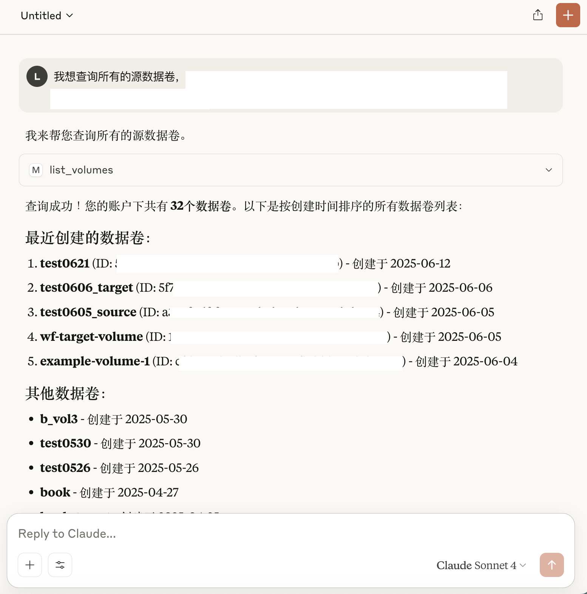

# MOI MCP 快速使用指南

## 什么是 MOI MCP？

MOI MCP（MatrixOne Intelligence Model Context Protocol）是 MatrixOne Intelligence 提供的智能服务接口，让 AI 助手可以直接使用 MOI 平台的各种数据处理和分析功能。

**MOI MCP 主要功能：**

- **创建连接器** - 连接各种数据源
- **载入数据** - 从不同数据源导入和处理数据
- **创建工作流** - 构建自动化的数据处理流程
- **获取解析后的数据** - 获取经过 MOI 处理和分析的结构化数据

## 可用工具

MOI MCP 提供了丰富的工具来满足不同的数据处理需求。以下是所有可用工具的详细说明：

> 术语说明：本文中的“目录/库/卷”均为数据中心下的资源层级概念，并非传统意义上的数据库概念。

### 📁 目录管理工具

- CreateCatalog - 创建新目录
- GetCatalogInfo - 获取目录详情
- GetCatalogList - 获取目录列表
- GetCatalogTree - 获取完整目录树结构
- DeleteCatalog - 删除目录

### 🗄️ 库管理工具

- CreateDatabase - 在指定目录下创建库
- GetDatabaseInfo - 获取库详细信息
- GetDatabaseList - 获取指定目录下的库列表
- GetDatabaseChildren - 获取库的子资源列表
- DeleteDatabase - 删除库

### 📦 卷管理工具

- CreateVolume - 在指定库下创建卷
- GetVolumeInfo - 获取卷详细信息
- DeleteVolume - 删除卷

### 📄 文件管理工具

- GetFileList - 列出卷内的文件条目
- DownloadFile - 下载文件

### 🔌 连接器管理工具

- CreateConnector - 创建新的数据源连接器（OSS、S3 等）
- ListConnectors - 获取现有连接器列表
- UpdateConnector - 更新连接器配置
- ListConnectorFiles - 列出连接器中的文件

### 📋 任务管理工具

- CreateLoadTask - 创建数据加载任务
- ListLoadTasks - 获取所有数据加载任务列表

### 🔄 工作流管理工具

- GetWorkflowMeta - 获取工作流详情
- CreateWorkflowMeta - 创建工作流
- ListWorkflowMetas - 获取工作流列表
- CreateWorkflowBranch - 创建工作流分支
- ListWorkflowBranches - 获取工作流分支列表
- GetWorkflowBranch - 获取工作流分支详情
- UpdateWorkflowBranch - 更新工作流分支
- DeleteWorkflowBranch - 删除工作流分支
- EnableWorkflowBranch - 启用工作流分支
- DisableWorkflowBranch - 禁用工作流分支

> 💡 **使用提示**：这些工具可以通过自然语言调用，AI 助手会自动选择合适的工具来完成您的请求。

## 1. MCP 配置

1. 进入您的 MCP 客户端（Cursor、Claude 等）设置，找到配置 MCP 服务器的地方（不同客户端位置可能不同）

2. 注册新的 MCP 服务器，在 `mcpServers` 下添加 "moi" 配置块，配置内容如下：

```json
{
  "mcpServers": {
    "mcp-moi-server": {
      "type": "streamable-http",
      "url": "https://mcp.m1intelligence.cn/mcp/",
      "note": "For Streamable HTTP connections, add this URL directly in your MCP Client",
      "headers": {
        "moi-key": "<your-api-key>"
      }
    }
  }
}
```

3. 保存配置文件后，**退出客户端并重新进入**，使配置生效

## 2. 获取 API Key

1. 访问 MatrixOne Intelligence 控制台
2. 进入 API 管理页面
3. 创建新的 API Key
4. 复制密钥并更新配置文件中的 `<your-api-key>`
5. 重启 AI 客户端

> 💡 **详细说明**：关于 API Key 的创建和管理，请参考 [API Key 管理文档](../workflow%20api/token_api.md#api-key-管理)

## 开始使用

完成上述两个步骤后，就可以在对话中使用 MOI MCP 功能了：

